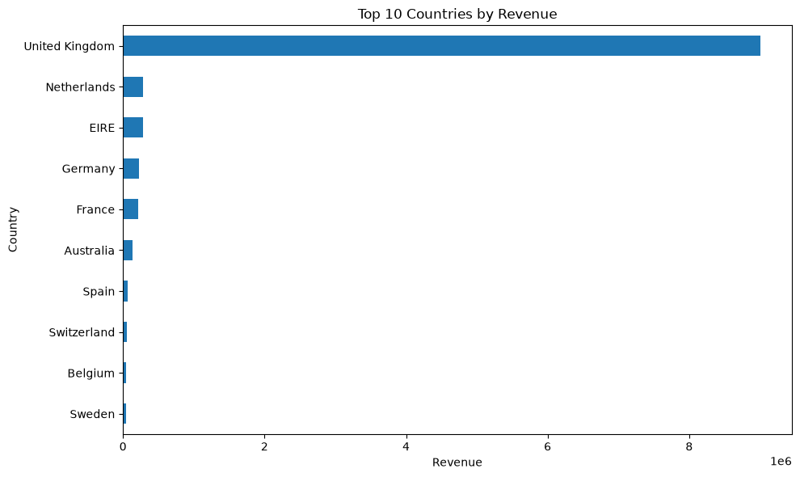
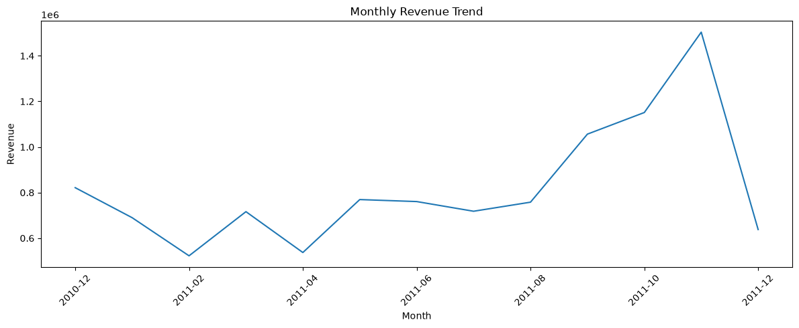
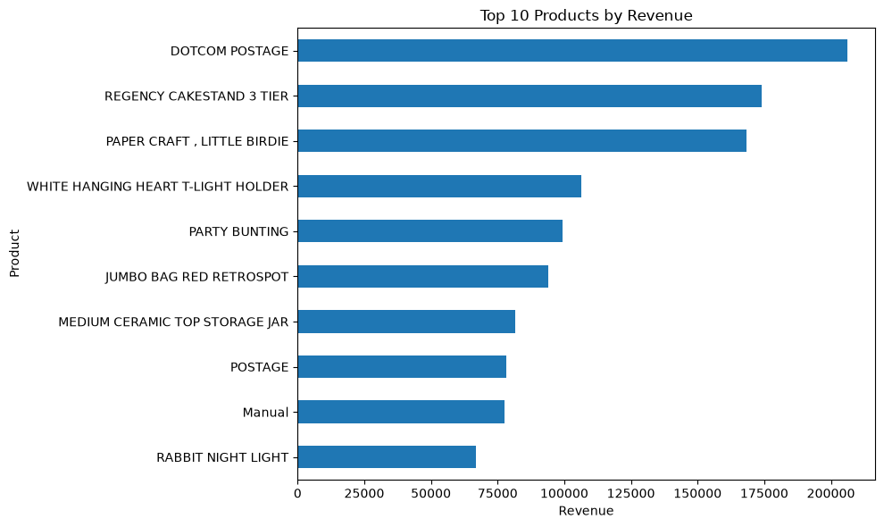
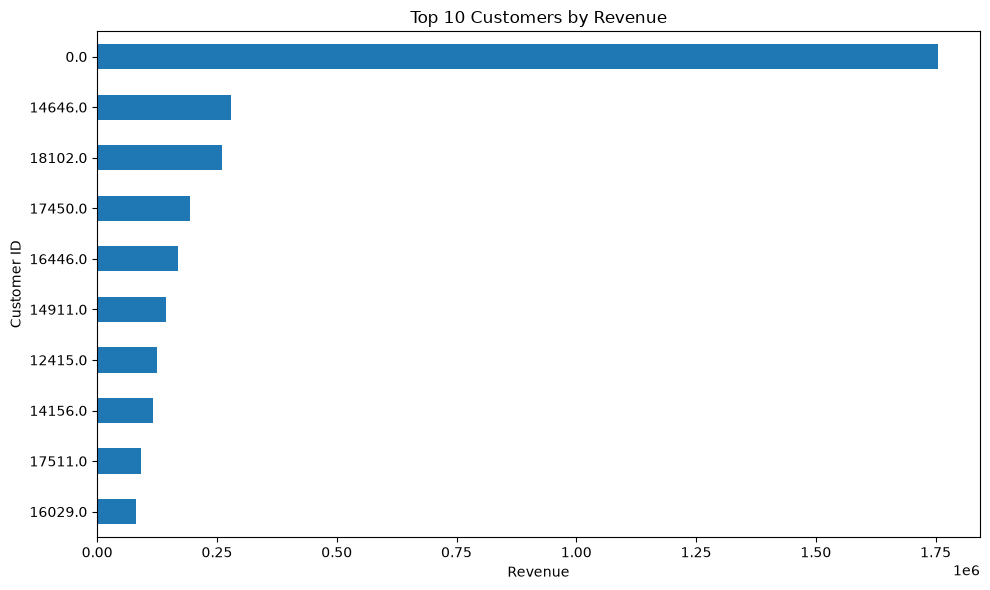
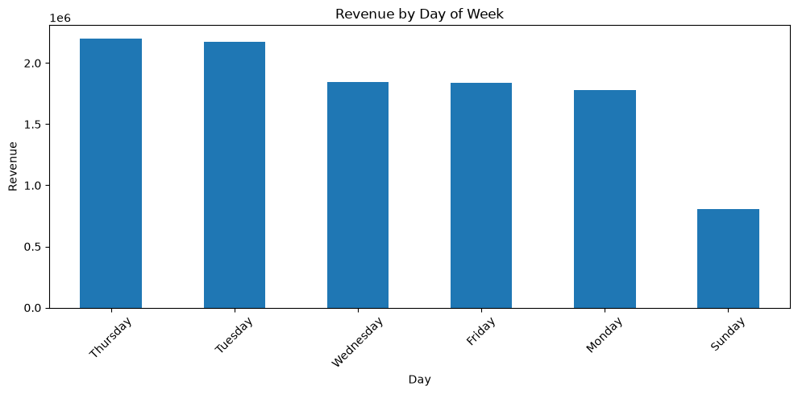
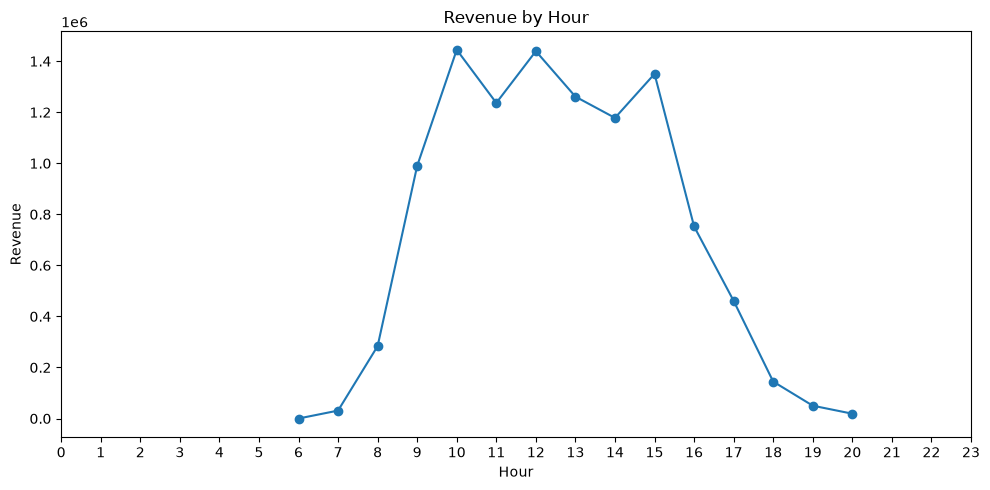
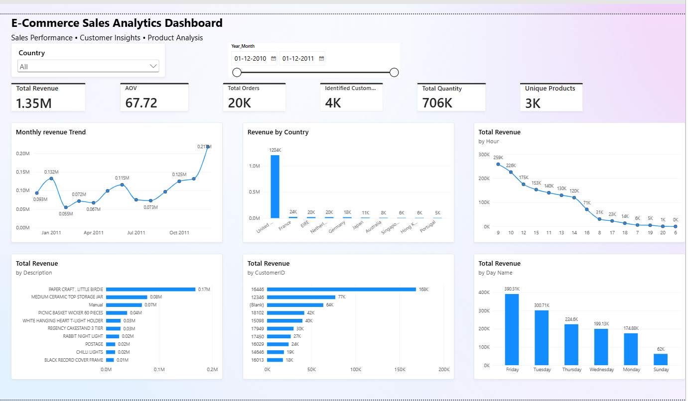

# E-Commerce Data Analytics

## 📌 Project Overview

This project analyzes e-commerce transaction data to identify sales trends, customer behavior, product performance, and business insights.

The project follows a complete data analytics workflow:

**Excel Dataset → MySQL → SQL Analysis → Python/Pandas → Data Visualization → Power BI**

---

## 🎯 Business Objectives

- Analyze overall sales and revenue performance
- Identify monthly sales trends
- Find top-performing products
- Analyze customer purchasing behavior
- Identify repeat and one-time customers
- Analyze sales by country
- Identify high-value customers
- Understand purchasing patterns by day and hour

---

## 🛠️ Tools & Technologies

- **Python**
- **Pandas**
- **NumPy**
- **Matplotlib**
- **Seaborn**
- **MySQL**
- **SQL**
- **Power BI**
- **Jupyter Notebook**
- **Excel**
- **GitHub**

---

## 📊 Dataset

The project uses the **Online Retail** dataset containing e-commerce transactions.

The dataset includes information such as:

- Invoice Number
- Stock Code
- Product Description
- Quantity
- Invoice Date
- Unit Price
- Customer ID
- Country

The dataset contains more than **500,000 transaction records**.

---

## 🗄️ SQL Analysis

The cleaned dataset was imported into MySQL and analyzed using SQL.

Key SQL analyses include:

- Total revenue
- Total orders
- Unique customers
- Unique products
- Monthly revenue
- Revenue by country
- Orders by month
- Top products by revenue
- Top products by quantity
- Top customers by revenue
- Top customers by order frequency
- Repeat vs one-time customers
- Revenue by day of week
- Revenue by hour
- Monthly revenue growth

---

## 🐍 Python Analysis

Python and Pandas were used for further analysis and visualization.

### Data Processing

- Loaded data from MySQL
- Checked dataset structure
- Analyzed missing values
- Calculated business KPIs
- Performed customer analysis
- Performed product analysis
- Performed time-based analysis

### Visualizations

The project includes visualizations for:

- Monthly revenue trends
- Revenue by country
- Top products by revenue
- Top products by quantity
- Top customers by revenue
- Top customers by number of orders
- Revenue by day of week
- Revenue by hour
- Monthly unique customers
- Customer revenue distribution
- Customer order frequency

---

## 📈 Key KPIs

| KPI | Value |
|---|---:|
| Total Revenue | £10,642,110.80 |
| Total Orders | 19,960 |
| Identified Customers | 4,338 |
| Unique Products | 3,922 |
| Total Quantity Sold | 5,572,420 |
| Average Order Value | £533.17 |
| Repeat Customer Rate | 65.58% |

---

## 💡 Key Insights

- The **United Kingdom** generated the majority of the revenue.
- Revenue increased substantially during **September–November 2011**.
- November 2011 recorded the highest monthly revenue in the dataset.
- A significant proportion of identified customers were repeat customers.
- Customer purchasing behavior varied considerably across customers.
- Sales activity varied by both day of week and hour of the day.
- A small group of customers contributed a substantial amount of identified-customer revenue.

> Note: December 2011 contains only partial-month data, so it should not be directly compared with complete months.

---

## 📁 Project Structure

```text
E-Commerce-Data-Analytics/
│
├── data/
│   ├── Online Retail.xlsx
│   ├── online+retail.zip
│   ├── ecommerce_cleaned.csv
│   └── ecommerce_python_analysis.csv
│
├── ecommerce_analysis.ipynb
├── requirements.txt
└── README.md
```

---

## ▶️ How to Run the Project

### 1. Clone the repository

```bash
git clone <your-github-repository-url>
```

### 2. Install required Python libraries

```bash
pip install -r requirements.txt
```

### 3. Open the Jupyter Notebook

Open:

```text
ecommerce_analysis.ipynb
```

### 4. MySQL Setup

Create the database:

```sql
CREATE DATABASE ecommerce_analytics;
```

Create the `ecommerce_data` table and import the cleaned transaction data.

### 5. Python–MySQL Connection

The notebook connects to MySQL using PyMySQL and loads the transaction data into Pandas for analysis.

---

## 📌 Skills Demonstrated

- Data Cleaning
- Exploratory Data Analysis
- SQL Querying
- MySQL
- Python
- Pandas
- NumPy
- Data Visualization
- Customer Analysis
- Sales Analysis
- Business KPI Analysis
- Power BI
- Data Storytelling

---

## 👨‍💻 Author

**Ayushman Singh**

GitHub: https://github.com/ayushmansinghh
## 📊 Python Analysis Visualizations

### Monthly & Country Revenue




### Product Revenue


### Customer Revenue


### Revenue by Day


### Revenue by Hour



## 📊 Power BI Dashboard

### E-Commerce Sales Analytics Dashboard

An interactive Power BI dashboard analyzing e-commerce sales performance, customer behavior, product performance, and revenue trends.

**Key Analysis Areas:**
- Revenue and order performance
- Monthly revenue trends
- Country-wise revenue
- Top products by revenue
- Top customers by revenue
- Revenue by day and hour
- Interactive Country and Date filters

### Dashboard Preview


### Power BI Files

- 
 [Power BI Dashboard (.pbix)](./powerbi/E-Commerce-Sales-Analytics-Dashboard.pbix.pbix)
[Dashboard PDF](./powerbi/E-Commerce-Sales-Analytics-Dashboard.pdf)
- 


